<div align="center">



<br/>


</div>

<br/>

just someone who ended up talking to computers for a living and, somehow, still likes it.
mostly living in `python`. sometimes wandering into `typescript` when a UI insists on existing.
lately: teaching LLMs to behave, arguing with vector databases, and pretending RAG pipelines are simple.

no roadmap here, no pitch — just a place to keep the commits.

```
currently around:  python · fastapi · django · langchain · postgres · redis · docker
usually online:     late, with coffee, questionable decisions
```

<br/>

<div align="center">
<sub>
<a href="https://www.linkedin.com/in/zakhar-vakhuta-d683b63a2/">linkedin</a>
&nbsp;·&nbsp;
<a href="mailto:vahutazahar@gmail.com">vahutazahar@gmail.com</a>
</sub>

<sub>— silverings</sub>
</div>
